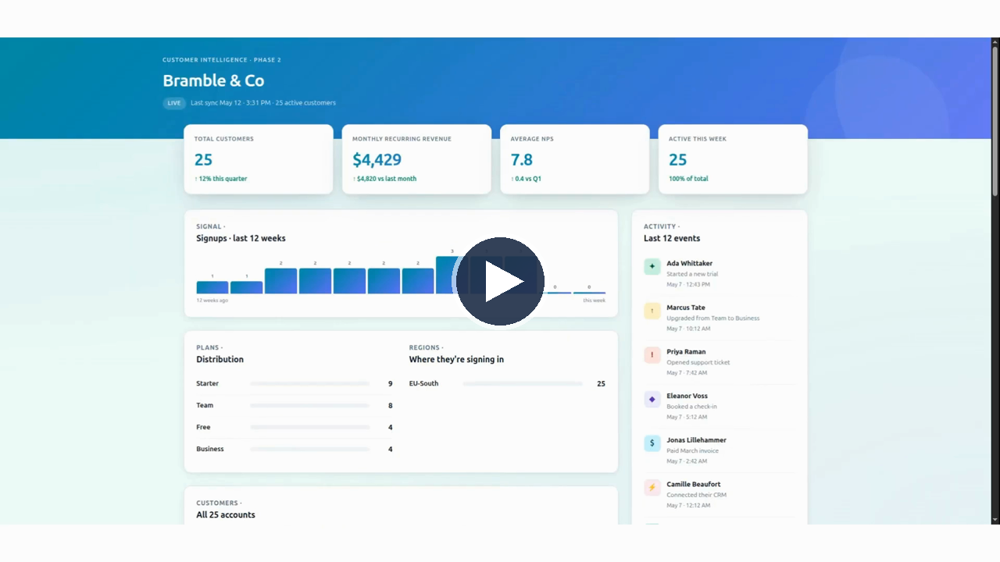

<p align="center">
  <picture>
    <source media="(prefers-color-scheme: dark)" srcset="./branding/wordmark-white.svg">
    
  </picture>
</p>

<p align="center">
  <a href="https://flatclaw.org">https://flatclaw.org</a>
</p>

<p align="center">
  <a href="https://flatclaw.org/branding/RawDemoFlatClaw.mp4">
    
  </a>
</p>
<p align="center">
  <em>▶ <a href="https://flatclaw.org/branding/RawDemoFlatClaw.mp4">Watch the 4-minute demo</a> · <a href="https://flatclaw.org">flatclaw.org</a></em>
</p>

**The open-source private-cloud AI coworker.** Chat, agent fleet, approvals, scheduled automation, document search, persistent agent memory, role-based access, voice, image, and a library of per-user OAuth tool integrations — packaged as a single-tenant appliance that deploys into the customer's own cloud tenancy — Microsoft Azure, AWS, Google Cloud, Northflank, or their own hardware. Everything — control plane and GPU — runs inside that tenancy, starting at 1× NVIDIA H100-class GPU (80 GB) and scaling horizontally as the tenant grows (bigger GPU plans, additional nodes — same architecture). Nothing leaves their tenancy. Every line of code is auditable. Data locality is mechanically verifiable, not marketed.

---

## Why it exists

Between January and April 2026, the entire frontier-lab industry converged on a single product shape: an agentic AI coworker with a task inbox, saved schedules, document memory, and direct access to local files and connected apps. Claude Cowork defined the category. Gemini Enterprise Agent is the identical-shaped response. GPT-6 + Atlas is the unified version.

Every one of those products is structurally cloud-hosted and sends your data to the vendor's servers on every request. For firms whose data contractually or legally cannot leave their own infrastructure — legal, healthcare, accounting, finance, government, and everyone adjacent — that category is unreachable.

FlatClaw is the same product shape, built out of open-source components, running entirely inside infrastructure the operator controls.

---

## Cloud partners

FlatClaw is a set of containers plus one GPU node. It runs wherever those exist, so a customer keeps their existing cloud account, their contracts, and their compliance posture. One tenancy per customer; the same public inference image on every lane; the customer holds the account and the bill.

| Lane | Tenancy | Status |
|---|---|---|
| **Northflank** | One project per tenant, managed H100 plans by the hour | **Reference lane.** The `{dev,prod}-up.sh` / `{dev,prod}-down.sh` lane scripts in [`infra/scripts/`](infra/scripts/) bring inference up and down today; every release is verified here first. |
| **Microsoft Azure** | A resource group in the customer's subscription — AKS or a single GPU VM (NC H100 v5 class), Entra ID sign-in, private endpoints; Fabric / Power BI hand-off when wanted | Delivered with an implementation partner using the same containers; one-command provisioning lane on the roadmap. |
| **Amazon Web Services** | An account and VPC the customer owns — EKS or a single GPU instance (p5 / g6e class), IAM + KMS, private VPC egress only | Delivered with an implementation partner; provisioning lane on the roadmap. |
| **Google Cloud** | A project the customer owns — GKE with A3 (H100) nodes or a single GPU VM, Workload Identity, VPC Service Controls | Delivered with an implementation partner; provisioning lane on the roadmap. |
| **Your own hardware** | Bare metal or a private Kubernetes cluster — an H100 or RTX PRO 6000-class card, the same containers | For data that cannot be in any cloud at all. |

The [cloud partners page](https://flatclaw.org/partners) has the detail per lane, and the [use case spotlights](https://flatclaw.org/use-cases) show what runs on them. The data-locality test below runs identically on each.

---

## v0.3.0 release scope

v0.1.0 shipped the architecture and the published inference image; v0.2.0 made it real to use (matured Portal, live H100 inference, first MCP services). **v0.3.0 hardens it into a governed product:** a human-approval engine on consequential MCP actions, a clean public/private split for MCP services, and the runtime pin moved to OpenClaw 2026.7.1. What's working today vs. what's coming next is enumerated in the [Roadmap](#roadmap) section below.

**Working today**
- **Live inference** — Gemma 4 31B-IT (FP8) on a single NVIDIA H100 via patched SGLang, served at the model's native **256K context window**, with the weights-server cold-boot pattern and one-command lane scripts (`prod-up.sh` / `prod-down.sh`, `dev-up.sh` / `dev-down.sh`).
- **FlatClaw Portal** — Next.js 16 + React 19 product surface: SSE-streamed chat with live token-usage + compaction markers, session management, a workspace file explorer with upload, an MCP services panel, per-user OAuth credential management, and an Admin panel for user + RBAC management.
- **MCP service integrations** — first-party Model Context Protocol servers shipping in [`mcp/public/`](mcp/public/): **Google** (Gmail / Calendar / Drive / Docs / Sheets / Contacts, OAuth) and **Jira** (Atlassian Cloud). Per-user credentials, scoped per `(tenant, user, service)`, never tenant-wide. Private add-on services (CRM, banking-core, host-panel connectors) follow the same plugin contract from `mcp/private/`, which stays out of the public repo by design.
- **Human approval engine** — consequential tools (`gmail_send`, `gmail_send_draft`, `drive_delete`, `drive_share`, Jira `delete_attachment`; operator-configurable) are never executed by the agent. The MCP composes the exact REST call and pauses it as a pending approval; a human signs off in the Portal queue and the portal replays the request with that user's own credentials. Deny records the rejection; every decision lands in the audit log.
- **Per-agent memory** via the OpenClaw runtime — built-in per-agent SQLite engine with keyword (BM25) search over each agent's `MEMORY.md` + `memory/*.md`; a starter `MEMORY.md` is seeded into every agent on creation / sync / backfill. No separate memory service to deploy or babysit. (Semantic recall via bge-m3 is v0.3.)
- **RBAC / tool access** — OpenClaw's built-in tool policy, surfaced from the portal: always-on per-agent cross-user isolation (deny-globs) **plus** an admin per-user *Tool Access* panel that toggles built-in + MCP tools on/off (writing the agent's native `tools.deny`). The gateway filters denied tools from the roster before the model sees them; per-user capability tokens scope data access underneath.
- **Public inference image** at [`ghcr.io/skytruax/flatclaw-inference:latest`](https://github.com/skytruax/FlatClaw/pkgs/container/flatclaw-inference) — SGLang base + entrypoint, lightweight, GHCR-published, GitHub Actions rebuilds on every Dockerfile/entrypoint change. Public — pull it and audit it.
- **Pinned, verified runtime** — OpenClaw **2026.7.1**, re-verified against the RBAC contract (tool-name flattening, deny-glob pipeline) on every pin bump; the verified version + date are surfaced in admin/audit.
- Apache 2.0 license, OSI-approved.

**Not in v0.3.0 — see [Roadmap](#roadmap)**
- **One-command tenant provisioning** — `provision-tenant.sh` / `destroy-tenant.sh` are honest stubs today; the working `{dev,prod}-up.sh` / `{dev,prod}-down.sh` lane scripts cover inference bring-up, and full net-new-tenant orchestration is the next deliverable.
- RAGFlow service manifest and ingest watcher (design shipped; deploy manifest is next).
- Additional skills (Scrapling web fetch, a first CRM connector).
- Voice (VoxCPM2), image (SDXL), TurboQuant 1M-context kernels, cascade routing.

---

## What's in the box

A complete coworker stack, not a framework. Every component is included and pre-integrated:

| Component | What it is |
|---|---|
| **FlatClaw Portal** | Next.js 16 + React 19 product surface — chat, agent fleet, approvals, cron scheduling, skills management, SSE-streamed tool use, plus FlatClaw-specific Docs and Memory panels and an Admin panel for owner-only RBAC management. |
| **OpenClaw runtime** | Self-hosted agent loop. Session management, tool use, multi-step planning, cron, approval gates, sandboxed tool execution. Enforces RBAC at every tool call. |
| **Inference service** | Patched SGLang + Gemma 4 31B Dense on a single NVIDIA H100-class GPU (80 GB, sm_90, native FP8) inside the customer's tenancy, served at the model's native 256K context. Model weights live on a tenancy-local volume served internally by the weights-server pod; new inference pods cold-boot in 60-90 seconds. |
| **Per-agent memory** | OpenClaw's built-in per-agent SQLite memory engine. Keyword (BM25) search over each agent's `MEMORY.md` and `memory/*.md`, indexed to `~/.openclaw/memory/<agentId>.sqlite`. A starter `MEMORY.md` is seeded into every agent on creation / sync / backfill; the agent maintains it across sessions. No separate memory service. Semantic (vector) recall via bge-m3 lands in v0.3. |
| **MCP service integrations** | First-party Model Context Protocol servers in [`mcp/public/`](mcp/public/): **Google** (Gmail / Calendar / Drive / Docs / Sheets / Contacts, OAuth) and **Jira** (Atlassian Cloud). Each is a self-contained package the agent calls over MCP. Per-user credentials, scoped per `(tenant, user, service)`, never tenant-wide. Consequential tools are composed (never executed) by the agent, pause in the Portal approvals queue for human sign-off, and are replayed with the user's own credentials on approve. Private add-on connectors plug into the same registry from `mcp/private/`. |
| **RAGFlow integration** *(roadmap, v0.3)* | Private document ingest and retrieval with cited sources. PDF, Docx, Excel, PPT, markdown, email, OCR'd scans, web pages. v0.2.0 ships the design; the deploy manifest + ingest watcher land next. |
| **RBAC + per-user credentials** | Multiple users per tenant, each a distinct agent. Tool access is OpenClaw's native per-agent `tools.deny`, surfaced as an admin **Tool Access** panel (per-user allow/deny over built-in + connected-MCP tools) on top of always-on cross-user roster isolation. Per-user credentials live in a per-tenant vault scoped `(tenant, user, service)`, brokered to each MCP via short-lived capability tokens. |
| **One-command tenant provisioning** *(roadmap, v0.3)* | The working `{dev,prod}-up.sh` / `{dev,prod}-down.sh` lane scripts cover inference bring-up today. `provision-tenant.sh` / `destroy-tenant.sh` — full net-new tenant lifecycle on the target cloud (project → weights volume → stager job → services → RBAC seed → Portal URL, and clean teardown; Northflank lane first) — are honest stubs; full orchestration is the next deliverable. |
| **One public inference image, every tenant** | [`ghcr.io/skytruax/flatclaw-inference:latest`](https://github.com/skytruax/FlatClaw/pkgs/container/flatclaw-inference) — public on GHCR, ~18 GB, SGLang base + entrypoint, no baked weights. Every FlatClaw deployment pulls this same image. Per-tenant differences live on the weights volume (model files, tenant data) and in the tenancy's secrets, never in the image. Auditable, reproducible, single source of truth. |

---

## Architecture

```
           ┌───────────────── Customer's cloud tenancy (one per tenant) ──────────────────┐
           │                                                                              │
 Browser ──► FlatClaw Portal (Next.js + React + SQLite)                                   │
           │    └─ Chat • Agents • Approvals • Cron • Skills • Docs • Memory              │
           │       • SSE /api/runtime/stream, intent routes /api/intents/*                │
           │                    │                                                         │
           │                    │  server-owned WebSocket                                 │
           │                    ▼                                                         │
           │              OpenClaw Gateway (ws://:18789)                                  │
           │                    │                                                         │
           │                    │  skills bus (local IPC / HTTP)                          │
           │                    │                                                         │
           │          ┌─────────┼─────────────┬──────────┐                                │
           │          ▼         ▼             ▼          ▼                                │
           │     Postgres   RAGFlow      Skills:     Sandbox                              │
           │    (optional   (docs in,    gmail •    (podman per                           │
           │     — only if  cited        gdrive •   tool exec)                            │
           │     we need    answers      scrapling  ↓                                     │
           │     extra      out)         voxcpm2    bash / filesys                        │
           │     projection │            sdxl       / network egress                      │
           │     state)     │            fs-paths   with review gates                     │
           │                │            rag-search                                       │
           │                ▼                                                             │
           │             /v1/embeddings                                                   │
           │                                                                              │
           │   Per-agent memory lives inside each agent's workspace                       │
           │   (~/.openclaw/workspace-<id>/memory/) — managed by OpenClaw itself.         │
           │                              ↓                                               │
           │                    ┌──────── Inference service (GPU) ────────┐               │
           │                    │  Lightweight image (SGLang base) +      │               │
           │                    │  Tenancy weights volume holding         │               │
           │                    │  Gemma 4 31B + bge-m3 (+ later voice    │               │
           │                    │  / image / TurboQuant 1M ctx)           │               │
           │                    │                                         │               │
           │                    │  GPU node, cloud or metal:              │               │
           │                    │  1× NVIDIA H100 (80 GB, sm_90, FP8)     │               │
           │                    └─────────────────────────────────────────┘               │
           │                                  ▲                                           │
           │                                  │ HTTP fetch at boot                        │
           │                          weights-server pod                                  │
           │                          (HTTP file server over the                          │
           │                           tenancy weights volume)                            │
           │                                                                              │
           │   Tenancy secrets (per-tenant OAuth tokens, per-user RBAC vault)             │
           │                                                                              │
           └──────────────────────────────────────────────────────────────────────────────┘
                                               │
                                               │  Provisioning lane deploys everything:
                                               │  Portal, Gateway, Inference (H100),
                                               │  RAGFlow, weights-server.
                                               ▼
                          Cloud provisioning API (Northflank today;
                          Azure / AWS / GCP lanes on the roadmap)
```

**Four services per tenant**, all in the customer's cloud tenancy:

1. **Portal** — 4 vCPU / 8 GB (`nf-compute-400` on the reference lane). FlatClaw-branded Next.js 16 + React 19 UI with Docs, Memory, and Admin panels.
2. **OpenClaw Gateway** — 4 vCPU / 8 GB. The agent runtime; enforces RBAC at every tool call. Owns per-agent memory under each agent's workspace.
3. **Inference service** — one GPU node: a managed H100 plan on the reference lane, NC H100 v5 / p5 / A3 class on Azure / AWS / Google Cloud, or bare metal on-prem. 1× NVIDIA H100-class GPU (80 GB, sm_90, native FP8). Held warm 24/7 in prod. Fetches weights at boot from `weights-server`.
4. **RAGFlow** — 2 vCPU / 8 GB + persistent volume. Tenant document corpus.

Plus a small **weights-server** pod (HTTP file server over a tenancy-local volume) that the inference pod fetches model weights from at boot. Not user-facing; not counted as a "service" in the four above.

The substrate — Northflank, AKS, EKS, GKE, or your own Kubernetes — provides ingress, TLS, DNS, observability, secrets, GPU scheduling, and tenancy lifecycle. OpenClaw manages sessions / cron / approvals / RBAC / memory. Portal owns the UI and an SQLite projection of relevant state. **Customer holds the cloud account directly** — the cloud bills the customer, never us.

---

## Cost and tokenomics

Indicative monthly costs on the reference lane (Northflank's published list pricing), single tenant, prod held warm 24/7. Azure NC H100 v5 and AWS p5 classes land in the same band on reserved terms; bare metal amortizes lower:

| Component | Plan | Approx. monthly |
|---|---|---|
| **Inference (H100 80GB)** | Managed H100 GPU plan, held warm | **~$1,800** |
| Portal | 4 vCPU / 8 GB | ~$50 |
| OpenClaw Gateway | 4 vCPU / 8 GB | ~$50 |
| weights-server + weights volume | small CPU pod + 200 GB nvme | ~$30 |
| Egress, TLS, observability, project mgmt | included | — |
| **Total per tenant, all-in** | | **~$2,000 / month** |

This is a **flat per-tenant rate, not per-token metering**, and it scales with the tenant — not with seat count. List prices and round numbers; committed-use or annual terms on any of the clouds typically reduce the GPU line. The inference line dominates — everything else combined is under $200.

### Why a dedicated H100 wins on cost

The economic case is structural, and it gets *stronger* at scale. Running Gemma 4 31B-IT on a dedicated H100 collapses the per-token API cost stack — GPU + multi-tenant spare capacity + orchestration + margin — down to GPU lease alone:

- **~$1.35 per 1M output tokens** self-hosted at a realistic 70% utilization, against **~$15** for Claude Sonnet 4.6 at list — about **11× cheaper per output token**, about 7× against Sonnet 5 at $10, and 18–37× against the frontier tier (Claude Opus 5 at $25, GPT-5.5 at $30, Claude Fable 5.1 at $50; September 2026 list prices).
- **Comparable output to Sonnet 4.6 at our configuration.** At 256K context, FP8 on a dedicated H100, with complexity-based routing, Gemma 4 31B-IT clears the bar for the majority of a tenant's workload at that ~1/11th cost. The frontier tier (Claude Opus 5, Fable 5.1, GPT-5.5) is reserved for the hardest fraction, routed up explicitly.
- **Breakeven is far behind, not ahead.** One H100 at ~$1,800–2,000/month at 60% utilization produces ~2B output tokens/month; the same volume at Sonnet list runs ~$30,000/month. Breakeven against Sonnet lands near 130M output tokens/month — a threshold a busy tenant clears in days, not months.
- **Utilization, not headcount, is the variable.** What the GPU serves is peak concurrent sessions, not total users. The per-tenant rate doesn't move as a tenant adds people; it moves when sustained concurrency outgrows one card — at which point the answer is a higher-tier or multi-GPU plan on the same cloud, same tenancy, same architecture.

The honest trade-offs (where self-hosting is *wrong* — low volume, low utilization, the hardest reasoning tasks) and the full cost-stack walkthrough are on the **[Tokenomics page](https://flatclaw.org/tokenomics)**.

---

## Technology choices

- **Inference runtime: patched SGLang + Gemma 4 31B Dense.** The best open-weight dense model in its class; SGLang is the fastest production runtime for it. Weights published by Google, pulled from Kaggle once onto a tenancy-local weights volume, served to the inference pod at boot via the in-project `weights-server`. New pods cold-boot in 60–90 seconds because they only pull the ~18 GB SGLang image and stream weights over the project's internal network; weights don't move per boot.
- **Silicon: NVIDIA H100 (80 GB, sm_90).** Native FP8 hardware on Hopper — no Marlin kernel fallback that breaks Gemma 4 31B's projection dims on Ampere. Sizes for Gemma 4 31B FP8 (~33 GB) + KV cache with comfortable headroom.
- **Scalable by design.** A single tenant starts on 1× H100. The same architecture scales horizontally — bigger tenants step up to higher GPU plans (more vCPU/RAM around the same GPU) or multi-GPU nodes (multiple H100s in the same tenancy), and the entire Portal/Gateway/RAGFlow layer scales independently of inference. Nothing in the design assumes single-GPU; that's just where each tenant starts.
- **Substrate: the customer's cloud.** The reference lane is Northflank's managed H100 fleet, scripted end-to-end today; the same containers run on Azure (AKS, NC H100 v5), AWS (EKS, p5 / g6e), Google Cloud (GKE, A3) and on bare metal. The substrate schedules the GPU node and handles ingress, secrets and lifecycle. Customer signs up with the cloud directly; we never sit between them and the substrate.
- **Context: TurboQuant turbo4 KV compression.** Custom CUDA kernels targeting Gemma 4 head dimensions on Hopper. Enables 1M-token context on a single card — "read your whole codebase / year of email" becomes real. Roadmap deliverable; shippable fallback is stock-SGLang FP8 at 128k context.
- **Agent runtime: OpenClaw.** Self-hosted, tool-use native, actively maintained, comfortable with multi-step planning and long-running sessions. Enforces RBAC at every tool invocation.
- **Frontend: FlatClaw Portal.** Next.js 16 + React 19 + TypeScript + SQLite, with Docs (RAGFlow), Memory (admin view onto each agent's `<workspace>/memory/`), and Admin (owner-only RBAC) panels wired into the OpenClaw gateway's SSE + intent routes.
- **Auth: `better-auth` for v1/v1.1 (email + Google/Microsoft OAuth login), WorkOS for v2 enterprise SSO** (per-tenant Okta / Azure AD / Google Workspace SAML configuration). Two distinct OAuth flows kept strictly separate: login OAuth identifies the user to FlatClaw (short-lived); tool OAuth grants the agent access to the user's connected services (long-lived, encrypted, scoped per `(tenant, user, service)`).
- **Retrieval: RAGFlow.** Wrapped as an OpenClaw skill behind a stable interface. Swappable without touching agent or UI.
- **Memory: OpenClaw's built-in per-agent memory engine.** Per-agent SQLite index (`~/.openclaw/memory/<agentId>.sqlite`) over each agent's `MEMORY.md` + `memory/*.md`. Keyword (BM25) search ships today and needs no external dependency; a starter `MEMORY.md` is seeded for every agent. No separate database to deploy, no separate failure domain.
- **Embeddings: bge-m3** *(roadmap, v0.3).* Multilingual, long-context. Powers semantic memory recall + RAG retrieval, served on its own GPU card (not co-resident with the 31B). v0.2.0 memory is keyword-only; bge-m3 adds the vector layer.
- **Deploy: one tenancy, any cloud.** One tenancy per customer — a Northflank project, an Azure resource group, an AWS account, a Google Cloud project, or an on-prem cluster — holds Portal, Gateway, Inference (GPU), RAGFlow, and the weights-server. The substrate handles ingress, TLS, DNS, observability, secrets, GPU scheduling, and lifecycle. No second cloud, no cross-cloud plumbing.
- **One image, every tenant.** [`ghcr.io/skytruax/flatclaw-inference:latest`](https://github.com/skytruax/FlatClaw/pkgs/container/flatclaw-inference) is public on GHCR. Every FlatClaw deployment — every customer's tenant project — pulls this same ~18 GB image. The SGLang base + entrypoint is universal; per-tenant differences live entirely on the weights volume (model files, tenant state) and in the tenancy's secrets. Anyone can pull and audit it directly. Pattern is reusable for VoxCPM2, SDXL, bge-m3, and any future model — same image, additional model directories on the volume.
- **Voice: VoxCPM2** *(roadmap, v0.3).* Open-weight voice cloning + TTS. Will be staged onto the weights volume and loaded co-resident on the H100 alongside Gemma.
- **Image: ComfyUI + SDXL** *(roadmap, v0.3).* Standard open-weight image generation. Same disk-staging pattern as Gemma.
- **Web fetching: Scrapling** *(roadmap, v0.3).* Private-internet retrieval with robots respected, as an MCP service under `mcp/`.

Every dependency is MIT / Apache / BSD compatible.

---

## Data locality is mechanically provable

The privacy story is not a marketing claim. It is a test you can run yourself.

1. Provision a tenant in your own cloud tenancy — Azure, AWS, Google Cloud, Northflank, or your own hardware.
2. Exercise the shipped features end-to-end (chat, per-agent memory, MCP services — Google / Jira — approval-gated actions, scheduled-task fire, GPU cold-boot). As more land (RAG, Scrapling, voice, image), each is added to this test loop.
3. Run `tcpdump` on the tenancy's egress for the full session.
4. Confirm zero packets to Anthropic, OpenAI, Google AI (the hosted Gemini/Vertex APIs), Hugging Face at runtime, ElevenLabs, Chroma Cloud, or any third-party inference endpoint. Only expected egress: services the user explicitly connected via OAuth (Gmail, Drive, scrape targets). Inference traffic stays inside the tenancy — Portal → Gateway → Inference (GPU) is all internal network. Kaggle is accessed only at the one-time weight-staging step, never at runtime.

This check runs mechanically on every release. It is the promise the project exists to keep.

---

## RBAC / tool access

FlatClaw leans entirely on OpenClaw's **built-in tool policy** — there's no custom gate to trust. Both layers are expressed as the agent's native `agents.list[<agentId>].tools.deny`, which the gateway applies *before the model sees its roster* (deny wins; denied tools are filtered out, not runtime-intercepted):

1. **Cross-user isolation (always on).** The portal computes per-agent deny-globs so each agent only ever sees its own per-user MCP servers; another user's `google-…__*` / `jira-…__*` tools are stripped from the roster before the model sees them.
2. **Per-user Tool Access (admin).** The Admin → Users → **Tool access** panel lists every tool the user's agent can use — built-in/plugin groups (read live from the gateway's `tools.catalog`) and each connected MCP service's tools (Gmail, Calendar, Jira, …), grouped and collapsible — as allow/deny toggles. Unchecking a tool writes its id into that agent's `tools.deny`; the gateway drops it from the roster on the next turn.

Underneath both, per-user **capability tokens** scoped `(tenant, user, service)` remain the data-access boundary — a user's MCP server can only reach that user's data regardless of which tools are exposed.

On top of tool visibility sits the **human approval engine**: approval-gated tools (outbound mail, destructive or exposing actions; operator-configurable per service) run their handler against a compose-mode API client — reads pass through, and the first mutating REST call is captured instead of sent. The captured request (method + URL + body, never credentials) surfaces as a pending card in the Portal approvals queue; on approve, the portal replays it with the requesting user's own vaulted credentials, guarded to that user's own workspace/API hosts. On deny, nothing executes. Both outcomes are recorded in the audit log with the approver's identity.

Nothing custom to install or enable: it's the gateway's own enforcement, configured from the portal.

## Pull and audit the inference image

The image is public on GHCR with no weights baked in — pull and inspect it directly:

```bash
docker pull ghcr.io/skytruax/flatclaw-inference:latest
docker inspect ghcr.io/skytruax/flatclaw-inference:latest    # labels, entrypoint, env
docker history --no-trunc ghcr.io/skytruax/flatclaw-inference:latest  # every layer
```

It is the SGLang base plus a single `entrypoint.sh` layer, built registry-to-registry by [`publish-inference.yml`](.github/workflows/publish-inference.yml) via `crane mutate`. Model weights are **not** in the image — they load at runtime from the per-tenant weights volume. So the same image is byte-identical across every tenant and every cloud; per-tenant differences live only on the volume and in the tenancy's secrets.

## Repository layout

| Path | What it is |
|---|---|
| [`portal/`](portal/) | FlatClaw Portal — Next.js 16 + React 19 admin + user surface, chat + fleet + approvals + cron + MCP services + Docs + Memory. |
| [`mcp/public/`](mcp/public/) | First-party Model Context Protocol servers — `google`, `jira`. One self-contained package per service; per-user, per-`(tenant, user, service)` credentials. Private add-on services live in `mcp/private/` (gitignored) and self-register through the same plugin contract. |
| [`web/`](web/) | flatclaw.org informational site — Next.js static export. |
| [`infra/inference/`](infra/inference/) | Inference service — Dockerfile (SGLang base), entrypoint, the reference-lane (Northflank) service manifest, and the stager-job recipe for one-time per-tenant weight staging onto the weights volume. |
| [`infra/scripts/`](infra/scripts/) | Inference + tenant lifecycle — the working `{dev,prod}-up.sh` / `{dev,prod}-down.sh` inference lane scripts and `install-openclaw.sh`; `provision-tenant.sh` / `destroy-tenant.sh` are v0.3 stubs (full net-new tenant orchestration). |
| [`branding/`](branding/) | FlatClaw wordmark (`wordmark.svg`, `wordmark-white.svg`) + attribution (`NOTICE.md`). |
| [`.github/workflows/publish-inference.yml`](.github/workflows/publish-inference.yml) | GitHub Actions pipeline that republishes `ghcr.io/skytruax/flatclaw-inference:latest` on changes to `Dockerfile` or `entrypoint.sh`. |
| [`SECURITY.md`](SECURITY.md) | Vulnerability reporting policy. |

---

## Verification

Every release ships with end-to-end tests for the features in scope. Tests grow as features land, never the other way around — silent hangs and feature claims without verification are release blockers.

**v0.3.0 verifies:**
- Inference image build pipeline: GitHub Actions republishes `:latest` on every change to `Dockerfile` or `entrypoint.sh`
- License + data-locality smoke: image manifest + LICENSE files match what the README claims
- MCP service round-trip: Google / Jira tool call through the Portal with per-user credentials
- RBAC / tool access: a tool denied for a user in the admin Tool Access panel is written to the agent's native `tools.deny` and filtered from its roster — verified end-to-end on a live model turn (denied → the model has no such tool; re-enabled → it returns), and via `portal/scripts/verify-tool-access.ts`
- Approval gating: an approval-gated tool (e.g. `gmail_send`) returns `PENDING_HUMAN_APPROVAL` with the composed request instead of executing; the roster advertises it as HUMAN-APPROVAL GATED; approve replays it with the user's own credentials, deny executes nothing
- OpenClaw pin: `agent-tool-policy` unit tests + a live deny round-trip re-run against the pinned runtime (2026.7.1) on every bump

**Roadmap (added as features land):**
- `provision-tenant.sh` → working tenant with TLS, and `destroy-tenant.sh` leaves no orphaned cloud resources (v0.3)
- RAG query with citation (v0.3)
- Scrapling fetch + first CRM connector (v0.3)
- Voice clone, image gen (v0.3)
- GPU cold-boot timing under 90s

---

## Roadmap

### v0.2.0 (shipped)

- **Live inference** — Gemma 4 31B-IT FP8 on a dedicated H100 at 256K context, via patched SGLang + the weights-server cold-boot pattern, with one-command lane scripts.
- **First MCP services** with per-`(tenant, user, service)` credentials and a generic per-service credential vault; matured Portal (SSE chat, sessions, file explorer, services panel, Admin); **per-user Tool Access** on OpenClaw's native `tools.deny` over always-on cross-user isolation.

### v0.3.0 (this release)

- **Human approval engine** — consequential MCP tools are composed, never executed: `PENDING_HUMAN_APPROVAL` envelope → Portal approvals queue → human sign-off → the portal replays the exact request with the requesting user's own credentials (workspace/host-guarded). Operator-configurable per service (`FLATCLAW_JIRA_APPROVAL_TOOLS`, `FLATCLAW_GOOGLE_APPROVAL_TOOLS`).
- **Public/private MCP split** — the repo ships `mcp/public/` (Google, Jira); private add-on connectors live in `mcp/private/` (gitignored) and self-register through the same plugin registry, so a tenant's add-ons never touch the public tree.
- **OpenClaw 2026.7.1** — runtime pin bumped and re-verified (tool-name contract, deny-glob pipeline, live deny round-trip); Portal approvals panel + per-service admin visibility controls.

### v0.4 (next)

- **One-command tenant provisioning** — `provision-tenant.sh` / `destroy-tenant.sh`: full net-new tenant lifecycle on the target cloud — Northflank lane first, Azure / AWS / Google Cloud lanes following (currently honest stubs; the `{dev,prod}-up.sh` lane scripts cover bring-up today).
- **RAGFlow service** — service manifest + per-tenant namespace template + ingest watcher daemon + `destroy-hook.sh`. Wrapped behind a stable retrieval interface.
- **Scrapling web fetch**, as an MCP service under `mcp/public/`; additional CRM/ERP connectors continue to ship as add-on services through the plugin registry.
- **Voice — VoxCPM2** open-weight cloning + TTS, co-resident on the H100.
- **Image — ComfyUI + SDXL**, same disk-staging pattern.
- **Cascade routing — multi-process serving on the same H100.** Small Gemma 4 4B FP8 (~4 GB) on `:8001` for simple chat / fast turns, Gemma 4 31B FP8 (~33 GB) on `:8000` for complex agent runs, voice on `:8002`, image on `:8003` — all co-resident under `--mem-fraction-static`, with ~25 GB headroom on the 80 GB card. OpenClaw routes by skill / agent.
- **TurboQuant turbo4** KV compression — custom CUDA kernels for Gemma 4 head dimensions on Hopper. Unlocks 1M-token context on a single card.

### v0.5+

- WorkOS SSO for v2 enterprise tenants (per-tenant Okta / Azure AD / Google Workspace SAML).
- Optional multi-tenancy on a shared GPU node for an entry tier (with strict K8s namespace + per-tenant volume isolation) — for tenants below the dedicated-GPU utilization threshold.
- Audio/video transcription ingest in RAGFlow.
- A "studio" for users to author their own skills.

---

## License

**FlatClaw itself**: Apache 2.0. See [`LICENSE`](LICENSE). Read, audit, fork, run, modify, redistribute — explicit patent grant included. OSI-approved.

**FlatClaw Portal**, **`mcp/` services**, **`web/`**, and **infra scripts**: Apache 2.0 (matching the root) unless otherwise noted in a subdirectory's own LICENSE.

**Inference image** ([`ghcr.io/skytruax/flatclaw-inference:latest`](https://github.com/skytruax/FlatClaw/pkgs/container/flatclaw-inference)): SGLang base + entrypoint only — no model weights. Apache 2.0. Public on GHCR — every FlatClaw deployment pulls this same image. Weights load at runtime from the tenancy-local weights volume, populated once by a stager job from Kaggle (`google/gemma-4/transformers/gemma-4-31b-it`) under Google's [Gemma Terms of Use](https://ai.google.dev/gemma/terms), redistributable per those terms with the accompanying license files preserved in the volume's `gemma-4-31b-it/` directory.
