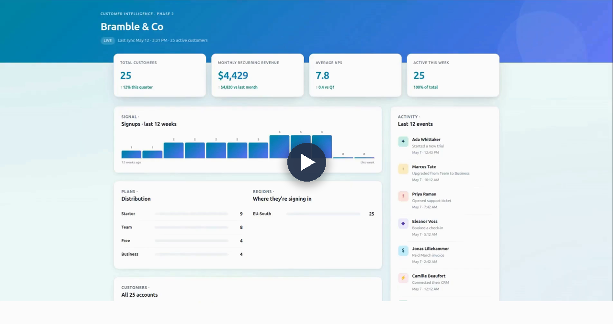

<p align="center">
  <picture>
    <source media="(prefers-color-scheme: dark)" srcset="./branding/wordmark-white.svg">
    
  </picture>
</p>

<p align="center">
  <a href="https://flatclaw.org">https://flatclaw.org</a>
</p>

<p align="center">
  <a href="https://flatclaw.org/branding/RawDemoFlatClaw.mp4">
    
  </a>
</p>
<p align="center">
  <em>▶ <a href="https://flatclaw.org/branding/RawDemoFlatClaw.mp4">Watch the 4-minute demo</a> · <a href="https://flatclaw.org">flatclaw.org</a> · <a href="https://flatclaw.org/builds/">Build recipes</a></em>
</p>

**The open-source Private AI Platform.** Chat, agents, approvals, scheduled automation, connectors to the systems you already run, persistent agent memory, role-based access, and the families of work that go with them (estimating, voice agents, documents in, reporting, knowledge search, approval-gated operations, content) — packaged as a single-tenant appliance that deploys into the customer's own cloud tenancy — Microsoft Azure, AWS, Google Cloud, Northflank, or their own hardware. Everything — control plane and GPU — runs inside that tenancy, starting at 1× NVIDIA H100-class GPU (80 GB) and scaling horizontally as the tenant grows (bigger GPU plans, additional nodes — same architecture). Nothing leaves their tenancy. Every line of code is auditable. Data locality is mechanically verifiable, not marketed.

---

## Why it exists

Between January and April 2026, the entire frontier-lab industry converged on a single product shape: an agentic AI coworker with a task inbox, saved schedules, document memory, and direct access to local files and connected apps. Claude Cowork defined the category. Gemini Enterprise Agent is the identical-shaped response. GPT-6 + Atlas is the unified version.

Every one of those products is structurally cloud-hosted and sends your data to the vendor's servers on every request. For firms whose data contractually or legally cannot leave their own infrastructure — legal, healthcare, accounting, finance, government, and everyone adjacent — that category is unreachable.

FlatClaw is the same product shape, built out of open-source components, running entirely inside infrastructure the operator controls.

---

## Cloud partners

FlatClaw is a set of containers plus one GPU node. It runs wherever those exist, so a customer keeps their existing cloud account, their contracts, and their compliance posture. One tenancy per customer; the same public inference image on every lane; the customer holds the account and the bill.

| Lane | Tenancy | Status |
|---|---|---|
| **Northflank** | One project per tenant, managed H100 plans by the hour | **Reference lane.** The `{dev,prod}-up.sh` / `{dev,prod}-down.sh` lane scripts in [`infra/scripts/`](infra/scripts/) bring inference up and down today; every release is verified here first. |
| **Microsoft Azure** | A resource group in the customer's subscription — AKS or a single GPU VM (NC H100 v5 class), Entra ID sign-in, private endpoints; Fabric / Power BI hand-off when wanted | Delivered with an implementation partner using the same containers; one-command provisioning lane on the roadmap. |
| **Amazon Web Services** | An account and VPC the customer owns — EKS or a single GPU instance (p5 / g6e class), IAM + KMS, private VPC egress only | Delivered with an implementation partner; provisioning lane on the roadmap. |
| **Google Cloud** | A project the customer owns — GKE with A3 (H100) nodes or a single GPU VM, Workload Identity, VPC Service Controls | Delivered with an implementation partner; provisioning lane on the roadmap. |
| **Your own hardware** | Bare metal or a private Kubernetes cluster — an H100 or RTX PRO 6000-class card, the same containers | For data that cannot be in any cloud at all. |

The [cloud partners page](https://flatclaw.org/partners) has the detail per lane, and the [use case spotlights](https://flatclaw.org/use-cases) show what runs on them. The data-locality test below runs identically on each.

---

## v0.4.0 release scope

v0.1.0 shipped the architecture and the published inference image; v0.2.0 made it real to use (matured Portal, live H100 inference, first MCP services); v0.3.0 added the human-approval engine and the public/private MCP split. **v0.4.0 makes it multi-user for real:** an opt-in mode with one OpenClaw gateway per user under its own operating-system account, the runtime moved to OpenClaw 2026.9.8 on Node 24 behind a pinned tenant baseline and a live gateway contract probe, the inference endpoint as a Portal setting, and an approvals queue that shows an approver the facts, the reasons and the outcome. What's working today vs. what's coming next is enumerated in the [Roadmap](#roadmap) section below.

**Working today**
- **Live inference, two model classes** — the **standard class**, Gemma 4 31B-IT (FP8) on a single NVIDIA H100 via patched SGLang at the model's native **256K context window**, running on every tenant today; and the **frontier class**, GLM-5.2 (744B mixture of experts, FP8, 1M window) across an eight-GPU H200 or B200 node, with local and cloud build sheets for both on [flatclaw.org/builds](https://flatclaw.org/builds/). Same weights-server cold-boot pattern and one-command lane scripts (`prod-up.sh` / `prod-down.sh`, `dev-up.sh` / `dev-down.sh`).
- **FlatClaw Portal** — Next.js 16 + React 19 product surface: SSE-streamed chat with live token-usage + compaction markers (a message sent while the agent is still working is queued for the next turn, never injected mid-run), sessions the model names itself after the first turns, a workspace file explorer with upload, an MCP services panel, per-user OAuth credential management, scheduled tasks, an inference-endpoint setting (model URL and id live in the Portal, not in a platform secret and a redeploy), and an Admin panel for user + RBAC management that shows each user's gateway status.
- **MCP service integrations** — first-party Model Context Protocol servers shipping in [`mcp/public/`](mcp/public/): **Google** (Gmail / Calendar / Drive / Docs / Sheets / Contacts, OAuth) and **Jira** (Atlassian Cloud). Per-user credentials, scoped per `(tenant, user, service)`, never tenant-wide. Private add-on services (CRM, banking-core, host-panel connectors) follow the same plugin contract from `mcp/private/`, which stays out of the public repo by design.
- **Human approval engine** — consequential tools (`gmail_send`, `gmail_send_draft`, `drive_delete`, `drive_share`, Jira `delete_attachment`; operator-configurable) are never executed by the agent. The MCP composes the exact REST call and pauses it as a pending approval; a human signs off in the Portal queue and the portal replays the request with that user's own credentials. Deny records the rejection; every decision lands in the audit log. The approvals card shows the request's facts (what, how much, for whom, how to reach the person affected), the tool's own reasons for not acting alone, and, when a replay fails, the error under the card while the item stays pending. The owning service's executor receives the approver's name, so it can write the sign-off back into its own record.
- **Per-agent memory** via the OpenClaw runtime — built-in per-agent SQLite engine with keyword (BM25) search over each agent's `MEMORY.md` + `memory/*.md`; a starter `MEMORY.md` is seeded into every agent on creation / sync / backfill. No separate memory service to deploy or babysit. (Semantic recall arrives with knowledge search, v0.6.)
- **RBAC / tool access** — OpenClaw's built-in tool policy, surfaced from the portal: always-on per-agent cross-user isolation (deny-globs) **plus** an admin per-user *Tool Access* panel that toggles built-in + MCP tools on/off (writing the agent's native `tools.deny`). The gateway filters denied tools from the roster before the model sees them; per-user capability tokens scope data access underneath.
- **One gateway per user (opt-in)** — `FLATCLAW_GATEWAY_MODE=per-user` runs one OpenClaw gateway per Portal user, each under its own operating-system account, state directory, port and token: created when the admin adds the user, supervised by the Portal (started at boot, restarted with backoff, stopped and removed cleanly), with the Portal's own secrets and anything credential-shaped filtered out of the gateway's environment. Another user's workspace, agent state and gateway token are denied by the operating system, not hidden by policy. A migration carries a shared-gateway install over (and back). Budget 1 to 1.2 GB of RAM per user.
- **Public inference image** at [`ghcr.io/skytruax/flatclaw-inference:latest`](https://github.com/skytruax/FlatClaw/pkgs/container/flatclaw-inference) — SGLang base + entrypoint, lightweight, GHCR-published, GitHub Actions rebuilds on every Dockerfile/entrypoint change. Public — pull it and audit it.
- **Pinned, verified runtime** — OpenClaw **2026.9.8** on **Node 24**. The Portal connects to the gateway as a backend client with its own device identity; gateway config goes through one read-modify-write path on the keyed agent roster; a tenant baseline pins the gateway settings that multi-user isolation depends on, decides every built-in tool by name and loads only an allowlisted set of plugins, so a new upstream default, tool or plugin cannot reach agents unreviewed. Portal chat text is never interpreted as gateway owner commands, and the browser event stream is filtered per agent. A live gateway contract probe ([`portal/scripts/gateway-contract-probe.ts`](portal/scripts/gateway-contract-probe.ts) — a stand-in model records what each agent is actually offered; no GPU needed) gates every pin bump alongside the unit tests; the verified version + date are surfaced in admin/audit. Upgrading an existing install migrates OpenClaw's state one way (`openclaw doctor --fix`), so back up `~/.openclaw` first. v0.3.0 remains the last release for OpenClaw 2026.7.1 / Node 22.
- Apache 2.0 license, OSI-approved.

**Not in v0.4.0 — see [Roadmap](#roadmap)**
- **Rule books as files and approvals by role** — the pattern proven on a customer-service agent this quarter (limits and escalation rules the business edits, applied as code; decisions written back to the system of record) generalized to every connector, with approvers routed by role (v0.5).
- **First-party connectors beyond Google and Jira** — commerce and CRM, mailbox and calendar, hosting panels, estimating from drawings — through the plugin contract, and the contract documented for partners (v0.5).
- **Channels** — a chat widget on the storefront, email in and out, Slack or Teams for internal agents (v0.5); **scheduled agents and reports** (v0.5); **model classes per tenant** (v0.5).
- **Voice agents on the customer's own lines, knowledge search with walls in it, managed provisioning on the Azure / AWS / Google Cloud lanes, enterprise sign-in, a developer agent** (v0.6 and later).

---

## What's in the box

A complete coworker stack, not a framework. Every component is included and pre-integrated:

| Component | What it is |
|---|---|
| **FlatClaw Portal** | Next.js 16 + React 19 product surface — chat, agent fleet, approvals, cron scheduling, skills management, SSE-streamed tool use, plus FlatClaw-specific Docs and Memory panels and an Admin panel for owner-only RBAC management. |
| **OpenClaw runtime** | Self-hosted agent loop. Session management, tool use, multi-step planning, cron, approval gates, sandboxed tool execution. Enforces RBAC at every tool call. |
| **Inference service** | Patched SGLang serving the tenant's model class inside its tenancy. Standard class: Gemma 4 31B Dense on one NVIDIA H100-class GPU (80 GB, sm_90, native FP8) at its native 256K context. Frontier class: GLM-5.2, a 744B mixture of experts at FP8 across eight H200 or B200 GPUs at 1M context. Model weights live on a tenancy-local volume served internally by the weights-server pod and are fetched at boot. |
| **Per-agent memory** | OpenClaw's built-in per-agent SQLite memory engine. Keyword (BM25) search over each agent's `MEMORY.md` and `memory/*.md`, indexed to `~/.openclaw/memory/<agentId>.sqlite`. A starter `MEMORY.md` is seeded into every agent on creation / sync / backfill; the agent maintains it across sessions. No separate memory service. Semantic recall arrives with knowledge search (v0.6). |
| **MCP service integrations** | First-party Model Context Protocol servers in [`mcp/public/`](mcp/public/): **Google** (Gmail / Calendar / Drive / Docs / Sheets / Contacts, OAuth) and **Jira** (Atlassian Cloud). Each is a self-contained package the agent calls over MCP. Per-user credentials, scoped per `(tenant, user, service)`, never tenant-wide. Consequential tools are composed (never executed) by the agent, pause in the Portal approvals queue for human sign-off, and are replayed with the user's own credentials on approve. Private add-on connectors plug into the same registry from `mcp/private/`. |
| **Knowledge search with walls in it** *(roadmap, v0.6)* | Cited answers over the tenant's own documents, where a user's search only ever sees what their role may read. Built on the same plugin contract as every other connector, so the approval and audit machinery applies to it unchanged. |
| **RBAC + per-user credentials** | Multiple users per tenant, each a distinct agent — and, in per-user mode, each in its own gateway under its own operating-system account. Tool access is OpenClaw's native per-agent `tools.deny`, surfaced as an admin **Tool Access** panel (per-user allow/deny over built-in + connected-MCP tools) on top of always-on cross-user roster isolation. Per-user credentials live in a per-tenant vault scoped `(tenant, user, service)`, brokered to each MCP via short-lived capability tokens. |
| **Managed provisioning** *(roadmap, v0.6)* | Tenant lifecycle as a delivered service: the `{dev,prod}-up.sh` / `{dev,prod}-down.sh` lane scripts bring inference up and down on the Northflank lane today; Azure, AWS and Google Cloud lanes follow with implementation partners. `provision-tenant.sh` / `destroy-tenant.sh` are honest stubs until then. |
| **One public inference image, every tenant** | [`ghcr.io/skytruax/flatclaw-inference:latest`](https://github.com/skytruax/FlatClaw/pkgs/container/flatclaw-inference) — public on GHCR, ~18 GB, SGLang base + entrypoint, no baked weights. Every FlatClaw deployment pulls this same image. Per-tenant differences live on the weights volume (model files, tenant data) and in the tenancy's secrets, never in the image. Auditable, reproducible, single source of truth. |

---

## Architecture

```
           ┌───────────────── Customer's cloud tenancy (one per tenant) ──────────────────┐
           │                                                                              │
 Browser ──► FlatClaw Portal (Next.js + React + SQLite)                                   │
           │    └─ Chat • Sessions • Files • Approvals • Scheduled tasks                  │
           │       • Admin: users, tool access, services, inference setting, audit        │
           │                    │                                                         │
           │                    │  server-owned WebSocket, device identity                │
           │                    ▼                                                         │
           │       OpenClaw gateway(s) — one shared gateway, or one per user under its    │
           │       own operating-system account (v0.4.0), supervised by the Portal        │
           │                    │                                                         │
           │                    │  per-user MCP servers (stdio) + capability tokens       │
           │          ┌─────────┼─────────────┬──────────────────┐                        │
           │          ▼         ▼             ▼                  ▼                        │
           │       Google      Jira      Add-on connectors    Sandbox                     │
           │      (Gmail,   (Atlassian   (CRM, commerce,     (bash / filesystem /         │
           │       Drive,    Cloud)      mailbox, hosting,    network egress, with        │
           │      Calendar…)             estimating…)         approval gates)             │
           │                                                                              │
           │   Approvals queue · audit log · per-agent memory in each agent's workspace   │
           │                              ↓  OpenAI-compatible HTTP, internal network     │
           │                    ┌──────── Inference service (GPU) ────────┐               │
           │                    │  Public SGLang image + the tenancy's    │               │
           │                    │  weights volume. Standard class: Gemma  │               │
           │                    │  4 31B FP8, 256K, on 1× H100 80 GB.     │               │
           │                    │  Frontier class: GLM-5.2 FP8, 1M, on    │               │
           │                    │  8× H200 / B200. Chosen per tenant.     │               │
           │                    └─────────────────────────────────────────┘               │
           │                                  ▲                                           │
           │                                  │ HTTP fetch at boot                        │
           │                          weights-server pod                                  │
           │                          (HTTP file server over the                          │
           │                           tenancy weights volume)                            │
           │                                                                              │
           │   Tenancy secrets (per-user credential vault, gateway tokens)                │
           └──────────────────────────────────────────────────────────────────────────────┘
                                               │
                                               │  Provisioning lane deploys everything:
                                               │  Portal (+ gateways), Inference (GPU),
                                               │  weights-server.
                                               ▼
                          Cloud provisioning API (Northflank today;
                          Azure / AWS / GCP lanes on the roadmap)
```

**Three services per tenant**, all in the customer's cloud tenancy:

1. **Portal** — 4 vCPU / 8 GB (`nf-compute-400` on the reference lane). FlatClaw-branded Next.js 16 + React 19 UI with Docs, Memory, and Admin panels.
2. **OpenClaw Gateway** — 4 vCPU / 8 GB. The agent runtime; enforces RBAC at every tool call. Owns per-agent memory under each agent's workspace. Two modes: one shared gateway with every user's agent on it (the default), or — since v0.4.0 — one gateway per user, each under its own operating-system account; in that mode the Portal supervises the gateways inside its own service, so this line folds into the Portal's plan plus 1 to 1.2 GB of RAM per user.
3. **Inference service** — one GPU node sized to the tenant's class. Standard class: one H100-class GPU (80 GB, sm_90, native FP8) — a managed H100 plan on the reference lane, NC H100 v5 / p5 / A3 on Azure / AWS / Google Cloud, or bare metal on-prem. Frontier class: an eight-GPU H200 or B200 node (ND H200 v5 / p5e / A3 Ultra, ND GB200 v6 / p6 / A4). Held warm 24/7 in prod. Fetches weights at boot from `weights-server`.
Plus a small **weights-server** pod (HTTP file server over a tenancy-local volume) that the inference pod fetches model weights from at boot. Not user-facing; not counted as a "service" in the four above.

The substrate — Northflank, AKS, EKS, GKE, or your own Kubernetes — provides ingress, TLS, DNS, observability, secrets, GPU scheduling, and tenancy lifecycle. OpenClaw manages sessions / cron / approvals / RBAC / memory. Portal owns the UI and an SQLite projection of relevant state. **Customer holds the cloud account directly** — the cloud bills the customer, never us.

---

## Cost and tokenomics

Indicative monthly costs on the reference lane (Northflank's published list pricing), single tenant, prod held warm 24/7. Azure NC H100 v5 and AWS p5 classes land in the same band on reserved terms; bare metal amortizes lower:

| Component | Plan | Approx. monthly |
|---|---|---|
| **Inference (H100 80GB)** | Managed H100 GPU plan, held warm | **~$1,800** |
| Portal | 4 vCPU / 8 GB | ~$50 |
| OpenClaw Gateway | 4 vCPU / 8 GB | ~$50 |
| weights-server + weights volume | small CPU pod + 200 GB nvme | ~$30 |
| Egress, TLS, observability, project mgmt | included | — |
| **Total per tenant, all-in** | | **~$2,000 / month** |

This is a **flat per-tenant rate, not per-token metering**, and it scales with the tenant — not with seat count. List prices and round numbers; committed-use or annual terms on any of the clouds typically reduce the GPU line. The inference line dominates — everything else combined is under $200.

### Why a dedicated node wins on cost

The economic case is structural, and it gets *stronger* at scale. A node held warm for one tenant collapses the per-token API cost stack — GPU + multi-tenant spare capacity + orchestration + margin — down to the GPU line. Two classes, two different things bought:

- **Standard class, about $0.66 per 1M output tokens** all-in (Gemma 4 31B at FP8 on one H100, about 1,260 output tokens/s aggregate, about 3.3B tokens a month), against **$10** for Claude Sonnet 5.5 at list — about **15× cheaper per output token** for the same tier of work — and 30–76× against the frontier tier (Claude Opus 5.5 at $20, GPT-5.5 at $30, Claude Fable 5.1 at $50; October 2026 list prices). On the box you own it is about $0.19.
- **Frontier class, about $1.04 per 1M output tokens** on an eight-H200 node held warm (GLM-5.2 at FP8 with multi-token prediction, about 6,800 output tokens/s, about 18B tokens a month), about $0.54 on eight B200s at NVFP4 (about 24,000 tokens/s, 64B tokens a month), about $0.80 on the eight-card server you own: 19–93× cheaper than the frontier-lab tier for a model in the same class, running inside the tenancy, and a quarter to an eighth of what renting the same open weights from a hosted API costs ($4.40). And it is not gated: security research, red-team tooling and other dual-use work run under the tenant's own rule books and audit trail, with no provider-side classifier deciding what the model will help with.
- **The same month, billed by the token.** The standard node's 3.3B tokens a month would cost about $33,000 at Sonnet 5.5 rates; the H200 node's 18B would cost about $360,000 at Opus 5.5 rates and $79,000 even at Z.ai's rate for the same open weights. The flat rates are $2,200 and $18,700.
- **Utilization, not headcount, is the variable.** What the GPU serves is peak concurrent sessions, not total users. The per-tenant rate doesn't move as a tenant adds people; it moves when sustained concurrency outgrows one card — at which point the answer is a second card, or the frontier class, on the same cloud, same tenancy, same architecture.

The honest trade-offs (where self-hosting is *wrong* — low volume, low utilization, the hardest reasoning tasks) and the full cost-stack walkthrough are on the **[Tokenomics page](https://flatclaw.org/tokenomics)**.

### Build recipes: what we actually run, and what it costs

**[flatclaw.org/builds](https://flatclaw.org/builds/)** is the hardware companion to this section. For each model class it puts a local build you can order today next to the cloud node that runs the same checkpoint:

- **Standard class — Gemma 4 31B at FP8, 256K context.** One 96 GB card locally (an RTX PRO 6000 Blackwell workstation, every part at Newegg's price), or the ~$2,000/month H100 plan above plus the control plane.
- **Frontier class — GLM-5.2, 744B parameters as a mixture of experts.** An eight-card 4U server that holds the FP8 checkpoint in 768 GB of VRAM, a two-card workstation for a 4-bit copy, and the eight-B200 cloud node tuned for speed, with the economy H200 node beside it.

Every part carries a live Newegg street price (refreshed hourly by a scheduled job; the page re-reads them every ten minutes), the quantization ladder shows what fits where, and each class has a printable build sheet with the local and cloud versions side by side. The recipes tab holds the two configurations behind it: the standard tenant (one H100, with its control plane and what cost us time) and the frontier class (GLM-5.2 on eight H200s, or quantized on a workstation).

---

## Technology choices

- **Inference runtime: patched SGLang, two model classes.** Standard class: Gemma 4 31B Dense, the best open-weight dense model in its class, on one card. Frontier class: GLM-5.2, a 744B mixture of experts with about 40B parameters active per token, MIT weights, on eight cards. SGLang is the fastest production runtime for both. Weights are pulled once onto a tenancy-local weights volume and served to the inference pod at boot via the in-project `weights-server`; pods only pull the ~18 GB SGLang image and stream weights over the project's internal network, so weights don't move per boot.
- **Silicon: NVIDIA H100 (80 GB, sm_90) for the standard class; eight H200 or B200 for the frontier class.** Native FP8 hardware on Hopper and Blackwell — no Marlin kernel fallback that breaks Gemma 4 31B's projection dims on Ampere. One card holds Gemma 4 31B FP8 (~33 GB) + KV cache with comfortable headroom; the eight-GPU node holds GLM-5.2's 744 GB FP8 checkpoint with KV room.
- **Scalable by design.** A standard tenant starts on 1× H100; a frontier tenant on an eight-GPU node. The same architecture scales horizontally — bigger tenants step up to higher GPU plans (more vCPU/RAM around the same GPU) or multi-GPU nodes (multiple H100s in the same tenancy), and the Portal and gateway layer scales independently of inference. Nothing in the design assumes single-GPU; that's just where each tenant starts.
- **Substrate: the customer's cloud.** The reference lane is Northflank's managed H100 fleet, scripted end-to-end today; the same containers run on Azure (AKS, NC H100 v5), AWS (EKS, p5 / g6e), Google Cloud (GKE, A3) and on bare metal. The substrate schedules the GPU node and handles ingress, secrets and lifecycle. Customer signs up with the cloud directly; we never sit between them and the substrate.
- **Context: 256K on the standard class, 1M on the frontier class.** Gemma 4 31B serves its full native window on one H100 at FP8; GLM-5.2 serves 1M on the B200 node with an FP8 KV cache. SGLang's RadixAttention prefix cache does most of the work on conversational reuse.
- **Agent runtime: OpenClaw.** Self-hosted, tool-use native, actively maintained, comfortable with multi-step planning and long-running sessions. Enforces RBAC at every tool invocation.
- **Frontend: FlatClaw Portal.** Next.js 16 + React 19 + TypeScript + SQLite: Chat, Sessions, Files, Approvals, Scheduled tasks and Admin (users, tool access, services, inference setting, audit) over the gateway's WebSocket and the Portal's own API routes.
- **Auth: Auth.js credentials sign-in** (email + password) with the Portal's own roles; enterprise single sign-on when a tenant needs it (roadmap). Two distinct credential flows kept strictly separate: the sign-in identifies the user to FlatClaw; tool OAuth grants the agent access to the user's connected services (long-lived, encrypted, scoped per `(tenant, user, service)`).
- **Connectors: one MCP server per service, one process per user,** registered through the managed-MCP plugin contract (tool groups, role-denied groups, workspace skills, prompt sections, an approval executor). First-party servers live in `mcp/public/`; add-ons plug in from `mcp/private/` without touching the public tree.
- **Memory: OpenClaw's built-in per-agent memory engine.** Per-agent SQLite index (`~/.openclaw/memory/<agentId>.sqlite`) over each agent's `MEMORY.md` + `memory/*.md`. Keyword (BM25) search ships today and needs no external dependency; a starter `MEMORY.md` is seeded for every agent. No separate database to deploy, no separate failure domain.
- **Deploy: one tenancy, any cloud.** One tenancy per customer — a Northflank project, an Azure resource group, an AWS account, a Google Cloud project, or an on-prem cluster — holds Portal, gateway(s), Inference (GPU) and the weights-server. The substrate handles ingress, TLS, DNS, observability, secrets, GPU scheduling, and lifecycle. No second cloud, no cross-cloud plumbing.
- **One image, every tenant.** [`ghcr.io/skytruax/flatclaw-inference:latest`](https://github.com/skytruax/FlatClaw/pkgs/container/flatclaw-inference) is public on GHCR. Every FlatClaw deployment — every customer's tenant project — pulls this same ~18 GB image. The SGLang base + entrypoint is universal; per-tenant differences live entirely on the weights volume (model files, tenant state) and in the tenancy's secrets. Anyone can pull and audit it directly. The pattern is reusable for every model class and for the voice and retrieval models that come later — same image, additional model directories on the volume.
- **Voice and knowledge search** *(roadmap, v0.6).* Voice agents on the customer's own lines and cited search over the tenant's documents are the next two families; both ride on the same rule books, approvals and audit trail as everything else, and both stage their models onto the tenancy weights volume like Gemma.

Every dependency is MIT / Apache / BSD compatible.

---

## Data locality is mechanically provable

The privacy story is not a marketing claim. It is a test you can run yourself.

1. Provision a tenant in your own cloud tenancy — Azure, AWS, Google Cloud, Northflank, or your own hardware.
2. Exercise the shipped features end-to-end (chat, per-agent memory, MCP services — Google / Jira — approval-gated actions, scheduled-task fire, GPU cold-boot). As more land (channels, voice agents, knowledge search), each is added to this test loop.
3. Run `tcpdump` on the tenancy's egress for the full session.
4. Confirm zero packets to Anthropic, OpenAI, Google AI (the hosted Gemini/Vertex APIs), Hugging Face at runtime, ElevenLabs, Chroma Cloud, or any third-party inference endpoint. Only expected egress: services the user explicitly connected via OAuth (Gmail, Drive, scrape targets). Inference traffic stays inside the tenancy — Portal → Gateway → Inference (GPU) is all internal network. Kaggle is accessed only at the one-time weight-staging step, never at runtime.

This check runs mechanically on every release. It is the promise the project exists to keep.

---

## RBAC / tool access

FlatClaw leans entirely on OpenClaw's **built-in tool policy** — there's no custom gate to trust. Both layers are expressed as the agent's native `agents.list[<agentId>].tools.deny`, which the gateway applies *before the model sees its roster* (deny wins; denied tools are filtered out, not runtime-intercepted):

1. **Cross-user isolation (always on).** The portal computes per-agent deny-globs so each agent only ever sees its own per-user MCP servers; another user's `google-…__*` / `jira-…__*` tools are stripped from the roster before the model sees them.
2. **Per-user Tool Access (admin).** The Admin → Users → **Tool access** panel lists every tool the user's agent can use — built-in/plugin groups (read live from the gateway's `tools.catalog`) and each connected MCP service's tools (Gmail, Calendar, Jira, …), grouped and collapsible — as allow/deny toggles. Unchecking a tool writes its id into that agent's `tools.deny`; the gateway drops it from the roster on the next turn.

Underneath both, per-user **capability tokens** scoped `(tenant, user, service)` remain the data-access boundary — a user's MCP server can only reach that user's data regardless of which tools are exposed.

**Shared mode vs. per-user mode.** In the default shared mode all agents share one gateway process and one operating-system account, so the boundaries above are OpenClaw's policy layer, not the kernel: an agent that runs an arbitrary shell command can reach files that belong to other users' agents on the same host — use shared mode for a team that already shares a workspace. In per-user mode (v0.4.0, `FLATCLAW_GATEWAY_MODE=per-user`) each user's agent runs in its own gateway under its own system account in a private state directory, with the Portal's secrets and anything credential-shaped filtered from that gateway's environment, so another user's workspace, agent state and gateway token are denied by the operating system rather than hidden.

On top of tool visibility sits the **human approval engine**: approval-gated tools (outbound mail, destructive or exposing actions; operator-configurable per service) run their handler against a compose-mode API client — reads pass through, and the first mutating REST call is captured instead of sent. The captured request (method + URL + body, never credentials) surfaces as a pending card in the Portal approvals queue; on approve, the portal replays it with the requesting user's own vaulted credentials, guarded to that user's own workspace/API hosts. On deny, nothing executes. Both outcomes are recorded in the audit log with the approver's identity.

Nothing custom to install or enable: it's the gateway's own enforcement, configured from the portal.

## Pull and audit the inference image

The image is public on GHCR with no weights baked in — pull and inspect it directly:

```bash
docker pull ghcr.io/skytruax/flatclaw-inference:latest
docker inspect ghcr.io/skytruax/flatclaw-inference:latest    # labels, entrypoint, env
docker history --no-trunc ghcr.io/skytruax/flatclaw-inference:latest  # every layer
```

It is the SGLang base plus a single `entrypoint.sh` layer, built registry-to-registry by [`publish-inference.yml`](.github/workflows/publish-inference.yml) via `crane mutate`. Model weights are **not** in the image — they load at runtime from the per-tenant weights volume. So the same image is byte-identical across every tenant and every cloud; per-tenant differences live only on the volume and in the tenancy's secrets.

## Repository layout

| Path | What it is |
|---|---|
| [`portal/`](portal/) | FlatClaw Portal — Next.js 16 + React 19 admin + user surface, chat + fleet + approvals + cron + MCP services + Docs + Memory. |
| [`mcp/public/`](mcp/public/) | First-party Model Context Protocol servers — `google`, `jira`. One self-contained package per service; per-user, per-`(tenant, user, service)` credentials. Private add-on services live in `mcp/private/` (gitignored) and self-register through the same plugin contract. |
| [`web/`](web/) | flatclaw.org informational site — Next.js static export. `web/data/builds.json` is the source of the [Build recipes](https://flatclaw.org/builds/) section; `web/scripts/price-watch.mjs` reads the Newegg prices it links, `web/scripts/build-sheets.mjs` renders the PDF build sheets. |
| [`infra/inference/`](infra/inference/) | Inference service — Dockerfile (SGLang base), entrypoint, the reference-lane (Northflank) service manifest, and the stager-job recipe for one-time per-tenant weight staging onto the weights volume. |
| [`infra/scripts/`](infra/scripts/) | Inference + tenant lifecycle — the working `{dev,prod}-up.sh` / `{dev,prod}-down.sh` inference lane scripts and `install-openclaw.sh`; `provision-tenant.sh` / `destroy-tenant.sh` are stubs until managed provisioning lands (see Roadmap). |
| [`branding/`](branding/) | FlatClaw brand kit: `BRAND.md` (child-brand guide), `flatclaw-brand.css` (tokens + classes), the wordmark (`wordmark.svg`, `wordmark-white.svg`), the Kirk \| FlatClaw lockup (`kirk-flatclaw-lockup.svg`, `-white.svg`), the demo poster, and attribution (`NOTICE.md`). |
| [`.github/workflows/publish-inference.yml`](.github/workflows/publish-inference.yml) | GitHub Actions pipeline that republishes `ghcr.io/skytruax/flatclaw-inference:latest` on changes to `Dockerfile` or `entrypoint.sh`. |
| [`SECURITY.md`](SECURITY.md) | Vulnerability reporting policy. |

---

## Verification

Every release ships with end-to-end tests for the features in scope. Tests grow as features land, never the other way around — silent hangs and feature claims without verification are release blockers.

**v0.4.0 verifies:**
- Inference image build pipeline: GitHub Actions republishes `:latest` on every change to `Dockerfile` or `entrypoint.sh`
- License + data-locality smoke: image manifest + LICENSE files match what the README claims
- MCP service round-trip: Google / Jira tool call through the Portal with per-user credentials
- RBAC / tool access: a tool denied for a user in the admin Tool Access panel is written to the agent's native `tools.deny` and filtered from its roster — verified end-to-end on a live model turn (denied → the model has no such tool; re-enabled → it returns), and via `portal/scripts/verify-tool-access.ts`
- Approval gating: an approval-gated tool (e.g. `gmail_send`) returns `PENDING_HUMAN_APPROVAL` with the composed request instead of executing; the roster advertises it as HUMAN-APPROVAL GATED; approve replays it with the user's own credentials and passes the approver's name to the service's executor; a failed replay leaves the item pending with the error shown; deny executes nothing
- OpenClaw pin: the `portal` unit suite (`npm test` — agent tool policy, tenant baseline, gateway config, device identity, stream events, chat commands, tool-call wrapper, inference settings) plus the live gateway contract probe (`portal/scripts/gateway-contract-probe.ts`) against the pinned runtime (2026.9.8) on every bump
- Per-user gateways: `portal/scripts/per-user-gateways-check.ts` — one gateway per user under its own account, another user's state denied by the operating system, the Portal's secrets absent from every gateway's environment, migration over and back
- Chat run lifecycle: a message sent mid-run is queued and delivered after the run ends; no tool call is dropped (browser-driven check)

**Roadmap (added as features land):**
- Rule books: a limit changed in the file changes the agent's decision on the next turn; a request routed by role reaches the right approver and nowhere else (v0.5)
- Connectors: every first-party connector's consequential action composes and parks, never executes, and its approval replays with the user's own credentials (v0.5)
- Channels: a storefront chat conversation ends as a case in the CRM with the transcript attached (v0.5)
- Voice: a call on the customer's own line ends the same way, with the recording reference (v0.6)
- GPU cold-boot timing under 90s

---

## Roadmap

### v0.2.0 (shipped)

- **Live inference** — Gemma 4 31B-IT FP8 on a dedicated H100 at 256K context, via patched SGLang + the weights-server cold-boot pattern, with one-command lane scripts.
- **First MCP services** with per-`(tenant, user, service)` credentials and a generic per-service credential vault; matured Portal (SSE chat, sessions, file explorer, services panel, Admin); **per-user Tool Access** on OpenClaw's native `tools.deny` over always-on cross-user isolation.

### v0.3.0 (shipped)

- **Human approval engine** — consequential MCP tools are composed, never executed: `PENDING_HUMAN_APPROVAL` envelope → Portal approvals queue → human sign-off → the portal replays the exact request with the requesting user's own credentials (workspace/host-guarded). Operator-configurable per service (`FLATCLAW_JIRA_APPROVAL_TOOLS`, `FLATCLAW_GOOGLE_APPROVAL_TOOLS`).
- **Public/private MCP split** — the repo ships `mcp/public/` (Google, Jira); private add-on connectors live in `mcp/private/` (gitignored) and self-register through the same plugin registry, so a tenant's add-ons never touch the public tree.
- **OpenClaw 2026.7.1** — runtime pin bumped and re-verified (tool-name contract, deny-glob pipeline, live deny round-trip); Portal approvals panel + per-service admin visibility controls.

### v0.4.0 (this release)

- **OpenClaw 2026.9.8 and Node 24** — the Portal connects to the gateway as a backend client with its own device identity, replacing the retired token-only Control UI handshake. Gateway config goes through one read-modify-write path on the keyed agent roster. A tenant baseline pins the gateway settings that multi-user isolation depends on, decides every built-in tool by name, and loads only an allowlisted set of plugins, so a new upstream default, tool or plugin cannot reach agents unreviewed. Chat text from Portal users is never interpreted as gateway owner commands, and the browser event stream is filtered per agent. A live gateway contract probe (a stand-in model records what each agent is actually offered; no GPU needed) gates every pin bump alongside the unit tests. Upgrading an existing install migrates OpenClaw's state one way (`openclaw doctor --fix`), so back up `~/.openclaw` first.
- **One gateway per user** — an opt-in mode (`FLATCLAW_GATEWAY_MODE=per-user`) in which the Portal runs one OpenClaw gateway per user, each under its own system account, state directory, port and token: created when the admin adds the user, supervised by the Portal (started at boot, restarted with backoff, stopped cleanly, removed), its environment stripped of the Portal's secrets and anything credential-shaped, and wired to the inference endpoint from one setting in the Portal instead of a platform secret and a redeploy. Verified against real OpenClaw 2026.9.8 gateways, with a migration that carries a shared-gateway install over and back. Costs 1 to 1.2 GB of RAM per user.
- **Portal** — approvals card with the request's facts, the tool's reasons and replay errors in place; the approver's name passed to the service executor; sessions named by the model; mid-run messages queued instead of injected (no dropped tool calls); the agent's skills folder hidden from the Files tab; one public-origin helper for every redirect behind a reverse proxy.
- **Managed-MCP plugin contract** — a service plugin declares its tool groups, which groups a role may not use, the skills it seeds into a connected workspace, the prompt sections it contributes, extra environment for its server, and the executor the approvals queue calls on approve; the Portal re-seeds role-derived tool denies on every connect and disconnect.

### v0.5 (next) — agents that run a process, with people in the loop

- **Rule books as files.** Limits, escalation rules and audit requirements written by the business in a file the agent reads, applied as code by any connector: inside the limits the agent acts, above them it composes the exact action and parks it. Proven this quarter on a customer-service agent that refunds inside limits, escalates with the customer's callback details, and writes every conversation back to the CRM with the transcript. v0.5 makes the rule-book format and its evaluator a platform feature every connector can declare.
- **Approvals as the operating console.** Requests routed to approvers by role, not only to the requester; each card shows the facts, the tool's reasons and how to reach the person affected; decisions and the approver's identity written back into the system of record; a weekly view of what the agents handled, resolved alone, or escalated.
- **First-party connectors through the plugin contract.** Commerce and CRM (Shopify, Dynamics 365), mailbox and calendar (IMAP, SMTP, CalDAV), hosting panels (cPanel), estimating from marked-up drawings, alongside Google and Jira. The contract (tool groups, role-denied groups, workspace skills, prompt sections, approval executor) documented so partners ship their own add-ons without touching the public tree.
- **Channels.** The agent where the customer already is: a chat widget on the storefront that runs the same rule book, email in and out, Slack or Teams for internal agents. Every channel ends in the same case record.
- **Scheduled agents and reports.** Daily and weekly digests, the report that writes itself across several ERPs, exceptions raised to a person; run by the gateway's own scheduler and shown in the Portal.
- **Model classes per tenant.** Standard (one H100-class card: Gemma 4 31B at FP8), large (two cards) and frontier (eight cards, a mixture-of-experts model) served by the same platform, chosen per tenant and swappable without touching agents; Tool Search for tenants with large tool rosters. Build sheets for the local and cloud versions of each class live on [flatclaw.org/builds](https://flatclaw.org/builds/).

### v0.6 and later

- **Voice agents on the customer's own lines** (intake, booking, after hours), built on the same rule books, approvals and case records.
- **Knowledge search with walls in it**: cited answers over the tenant's documents, each user seeing only what their role may read.
- **Managed provisioning** on the Azure, AWS and Google Cloud lanes with implementation partners; backup and restore of agent state; rehearsed upgrades gated by the contract probe.
- **Enterprise sign-in** (Okta, Entra ID, Google Workspace) when a tenant needs it.
- **A developer agent on the same platform** for the teams that build connectors.

- **Retired from the roadmap:** the April component list (RAGFlow as a named service, bge-m3, Scrapling, VoxCPM2, ComfyUI + SDXL, cascade routing, TurboQuant 1M-token context, shared-GPU tiers, a skills studio). The families they served are above, described by what customers get rather than by component; the components come back only when a family needs them.


---

## License

**FlatClaw itself**: Apache 2.0. See [`LICENSE`](LICENSE). Read, audit, fork, run, modify, redistribute — explicit patent grant included. OSI-approved.

**FlatClaw Portal**, **`mcp/` services**, **`web/`**, and **infra scripts**: Apache 2.0 (matching the root) unless otherwise noted in a subdirectory's own LICENSE.

**Inference image** ([`ghcr.io/skytruax/flatclaw-inference:latest`](https://github.com/skytruax/FlatClaw/pkgs/container/flatclaw-inference)): SGLang base + entrypoint only — no model weights. Apache 2.0. Public on GHCR — every FlatClaw deployment pulls this same image. Weights load at runtime from the tenancy-local weights volume, populated once by a stager job from Kaggle (`google/gemma-4/transformers/gemma-4-31b-it`) under Google's [Gemma Terms of Use](https://ai.google.dev/gemma/terms), redistributable per those terms with the accompanying license files preserved in the volume's `gemma-4-31b-it/` directory.
